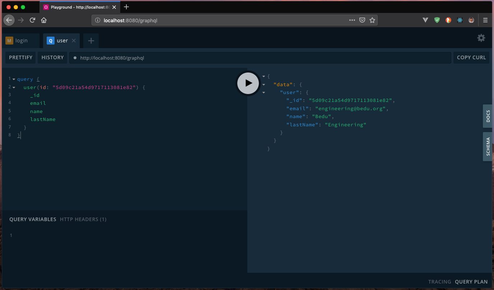

##### EJEMPLO 01
## OBTENIENDO SOLO UN USUARIO CON GRAPHQL

### OBJETIVO
Agregar un Query para obtener un usuario especifico usando argumentos.

### REQUERIMIENTOS

1. Mongo 4 o superior. [Download](https://www.mongodb.com/download-center/community).

### DESARROLLO
Lo primero que debemos saber antes de crear nuestro Query es saber que un argumento, es un atributo o conjunto de atributos que son enviados para realizar acciones dentro de nuestra lógica de negocio.

Los argumentos no necesitan ser obligatorios. Nosotros podemos agregar argumentos opcionales usando campos en valor `null`. Ahora para entender un poco mejor esto vamos a agregar el Query para obtener un usuario basado en su ID, esto lo agregaremos en nuestro archivo `src/schema/query.graphql`.
```graphql
type Query {
  status: String
  users: [User]
  user(id: ID!): User!
}
```

Si observamos el Query que acabamos de definir, podremos observar que estamos usando un tipo `ID`, este es propio de GraphQL y nos permite enviar el valor de un Id ya sea en formato `alfanúmerico` o solo `númerico`.

Ahora, procederemos ha agregar nuestra lógica del Query en el archivo `src/resolvers/query.js` en donde obtendremos el Id que se nos envía a través de la petición y retornaremos la información del usuario.
```js
import User from '../models/User';

const Query = {
  ...,
  user: (_, { id }, { currentUser }) => {
    if(!currentUser) {
      throw new Error('Unauthorized');
    }
    return User.findOne({ _id: id }).exec();
  }
};

export default Query;
```

Lo primero que estamos haciendo aquí es proteger la ruta para que solo usuarios autenticados puedan consumir este Query, recordemos que en los `resolvers` el segundo parámetro corresponde a los argumentos que se envían a través del `request`. Por último lo que hacemos es que a través de `mongoose` usamos el método `findOne` para enviar el `id` a buscar dentro de nuestra base de datos.

Vamos a comprobar que todo vaya bien, vamos a acceder a `http://localhost:8080/graphql` para acceder a `Playground` y lanzar la petición. Para hacerlo, necesitaras autenticarte a través del método `login` y obtener el `token`.



Ahora, podrás observar, que cuando enviamos un `Id` que no existe dentro de nuestra base de datos, recibimos un mensaje de que no podemos regresar un valor `null` ya que nuestro Query necesita retornar un elemento de tipo `User`.


¿Cómo harías para resolver este conflicto?