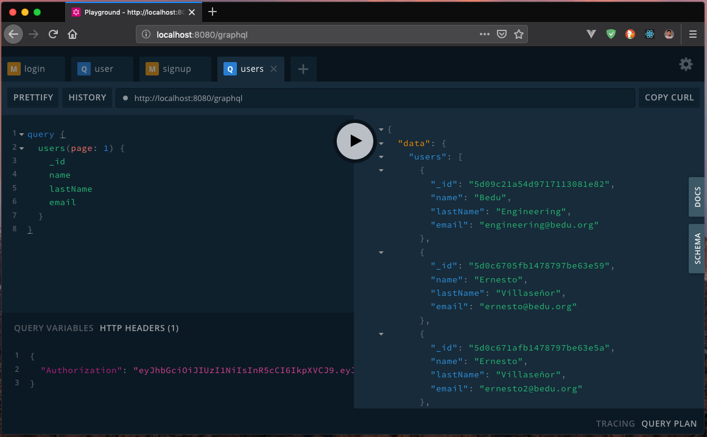
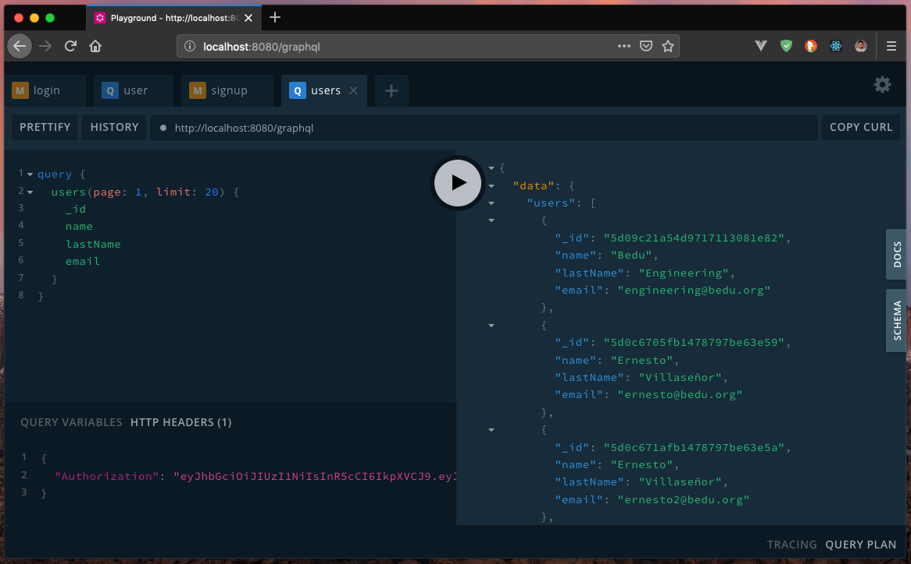

##### EJEMPLO 02
## PAGINAR RESULTADOS DE LOS USUARIOS REGISTRADOS

### OBJETIVO
A través de argumentos, añadir al Query de `User` el soporte para paginar un conjunto de datos.

### REQUERIMIENTOS
1. Proyecto con GraphQL API. [Ejemplo 01](../Ejemplo-01).
2. Mongo 4 o superior. [Download](https://www.mongodb.com/download-center/community).

### DESARROLLO
Lo primero que debemos saber es que vamos usar dos argumentos en nuestro Query para obtener `users`. El argumento `page` que nos permitirá indicar la página a mostrar y `limit` para indicarle el volumen de datos que voy a obtener por página.

Estos los agregaremos dentro de `src/schema/query.graphql` y colocaremos unos valores por defecto.
```graphql
type Query {
  status: String
  users(page: Int = 1, limit: Int = 10): [User]
  user(id: ID!): User!
}
```

De esta forma, ahora nuestro Query puede recibir estos párametros y podremos utilizarlos dentro de nuestro `resolver`. Para eso iremos a nuestro archivo `src/resolvers/query.js` en donde agregaremos la siguiente lógica:
```js
users: (_, { page, limit }, { currentUser }) => {
  if(!currentUser) {
    throw new Error('Unauthorized');
  }
  const skip = (page - 1) * limit;
  return User.find().skip(skip).limit(limit).exec();
}
```

Recordemos que para recuperar nuestros datos que hemos enviado lo podremos hacer en el segundo parametro que obtenemos a través del `resolver`. De esta forma como podemos ver estamos obteniendo ambos valores del parametro utilizando `destructuring` de ES6.

También, podremos observar que en esta línea estamos calculando los elementos a obtener dependiendo de la página en la que nos encontramos.
```js
const skip = (page - 1) * limit;
```

Como podemos comprender lo anterior, recuerda que nuestro límite por defecto es `10` entonces si nos encontramos en la página `1`, los valores a ignorar sería ya que empezariamos desde el `0` al elemento `10`. En todo caso, si estuvieramos en la pagina `2`, entonces omitiriamos los primeros `10` y comenzariamos apartir del `11`.

Y por último, le enviamos estos valores Mongo DB para que pueda interpretar nuestra paginación.
```js
return User.find().skip(skip).limit(limit).exec();
```

Ahora, vamos a probar nuestra implementación de páginación.



Como podrás observar únicamente el argumento `page`, recordemos que estos argumentos son opcionales y en caso de no ser enviados se utilizan los valores por defecto, ahora vamos a cambiar de página.


Y por último, usaremos el argumento `limit` para indicarle que cada página debería mostrar `20` resultados, recuerda que nuestro límite por defecto, es `10`.


