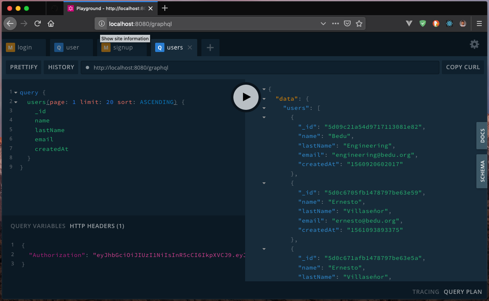
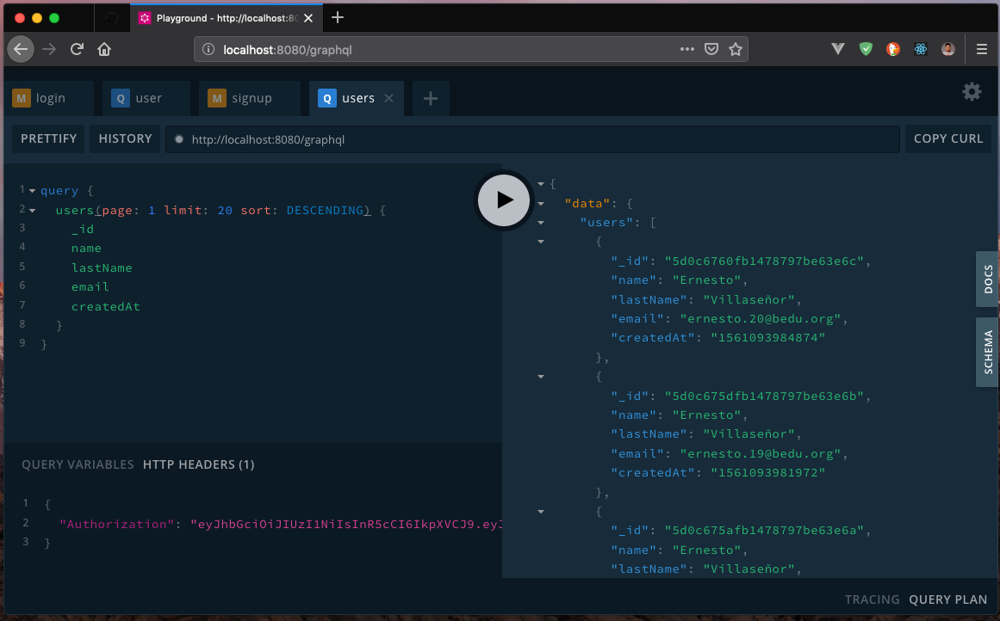

##### EJEMPLO 03
## ORDENANDO REGISTROS CON GRAPHQL

### OBJETIVO
A través de un argumento, enviar a un Query como se van a ordenar nuestros registros.

### REQUERIMIENTOS
1. Proyecto con GraphQL API. [Ejemplo 02](../Ejemplo-02).
2. Mongo 4 o superior. [Download](https://www.mongodb.com/download-center/community).

### DESARROLLO
Lo primero que vamos a agregar a nuestro Query son los argumentos que nos permitirán enviar tanto el campo a ordenar y si es ascendente o descendente. Pero antes de hacer eso, tendremos que definir que campos podemos enviar a nuestro servicio. Para ello, nos vamos a dirigir al archivo `src/schema/query.graphql`.
```graphql
enum SortDirection {
  ASCENDING,
  DESCENDING
}

enum SortableUserField {
  createdAt
}

type Query {
  status: String
  users(
    page: Int = 1
    limit: Int = 10
    sort: SortDirection = DESCENDING
    sortBy: SortableUserField = createdAt
  ): [User]
  user(id: ID!): User!
}
```

Como podrás observar, ahora tenemos dos tipos que son `enum` esto signifca, los `enum` nos permiten a diferencia de `int`, `ID`, etc, es que podemos definir valores como tipos. Los que estamos indicando en el enum `SortDirection` es que tenemos dos valores disponibles `ASCENDING` o `DESCENDING`, y de momento, en `SortableUserField` solo el valor `createdAt` que corresponde a un campo del usuario.
```graphql
enum SortDirection {
  ASCENDING,
  DESCENDING
}

enum SortableUserField {
  createdAt
}
```

También, podrás observar que en el Query de `Users` ahora tenemos dos atributos más `sort` y `sortBy`, donde `sort` es para indicar el tipo de ordenamiento y `sortBy` el campo por el que se va a ordenar. Además, si prestas atención hemos agregado sus valores por defecto correspondientes.
```graphql
users(
    page: Int = 1
    limit: Int = 10
    sort: SortDirection = DESCENDING
    sortBy: SortableUserField = createdAt
  ): [User]
```

Ahora, una ves que nuestro Query ya soporta el envío de estos parámetros vamos a agregar la lógica a nuestro `resolver`, para eso, vamos a dirigirnos a `src/resolvers/query.js`, y agregaremos nuestra lógica.
```js
users: (_, { page, limit, sort, sortBy }, { currentUser }) => {
  if(!currentUser) {
    throw new Error('Unauthorized');
  }
  const skip = (page - 1) * limit;
  return User
    .find()
    .skip(skip)
    .limit(limit)
    .sort({
      [`${sortBy}`]: `${sort}`
    })
    .exec();
}
```

Como puedes observar, ahora estamos obteniendo los campos `sort` y `sortBy` desde los argumentos enviados a nuestro Query. Ahora, lo que tenemos que hacer, es indicarle a `mongoose` el campo y la forma de ordenar los resultados, para eso, vamos a utilizar el método `Query.sort` de `mongoose`.
```js
query.sort({ field: 'field', test: 'asc, desc, ascending, descending, 1, -1' })
```

Este método acepta todas esas opciones, pero nosotros las hemos definido en mayusculas, no te preocupes, `MongoDB` también sabe interpretarlo de esa forma.

Ahora, lo único que tenemos que agregar es nuestro método `sort`.
```js
User
  .find()
  .skip(skip)
  .limit(limit)
  .sort({
    [`${sortBy}`]: `${sort}`
  })
  .exec();
```

Como podrás observar estoy usando `computed properties` de ES6 para crear un clave (key) de un objecto de forma dinámica usando el valor del campo a tratar, y su valor, corresponde al tipo de ordenamiento, en este caso, `ASCENDING` o `DESCENDING`.

Vamos probar nuestro Query con ordenamiento. Vamos a dirigirnos a `http://localhost:8080/graphql`.



Y ahora, vamos a indicarle que los muestre en modo `descendente`.

